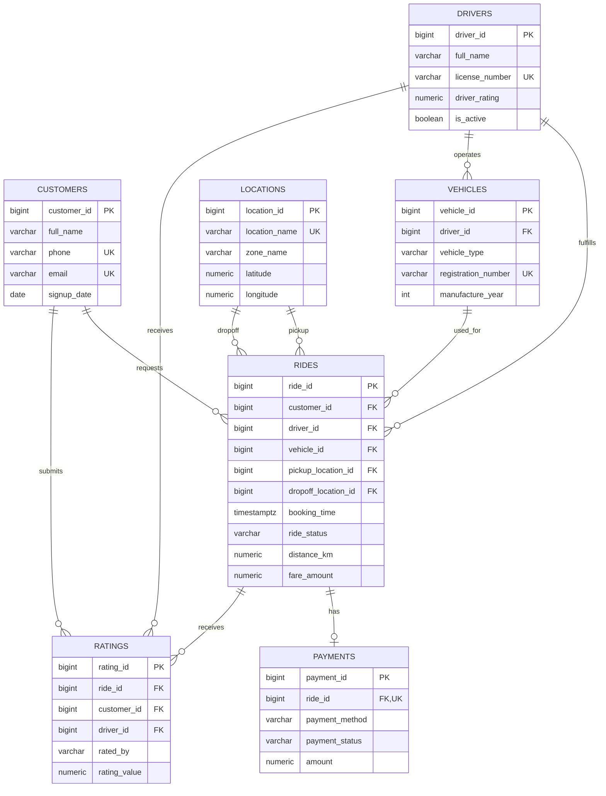

# ER Diagram

```mermaid
erDiagram
    CUSTOMERS ||--o{ RIDES : requests
    DRIVERS ||--o{ RIDES : fulfills
    DRIVERS ||--o{ VEHICLES : operates
    VEHICLES ||--o{ RIDES : used_for
    LOCATIONS ||--o{ RIDES : pickup
    LOCATIONS ||--o{ RIDES : dropoff
    RIDES ||--o| PAYMENTS : has
    RIDES ||--o{ RATINGS : receives
    CUSTOMERS ||--o{ RATINGS : submits
    DRIVERS ||--o{ RATINGS : receives

    CUSTOMERS {
        bigint customer_id PK
        varchar full_name
        varchar phone UK
        varchar email UK
        date signup_date
    }

    DRIVERS {
        bigint driver_id PK
        varchar full_name
        varchar license_number UK
        numeric driver_rating
        boolean is_active
    }

    VEHICLES {
        bigint vehicle_id PK
        bigint driver_id FK
        varchar vehicle_type
        varchar registration_number UK
        int manufacture_year
    }

    LOCATIONS {
        bigint location_id PK
        varchar location_name UK
        varchar zone_name
        numeric latitude
        numeric longitude
    }

    RIDES {
        bigint ride_id PK
        bigint customer_id FK
        bigint driver_id FK
        bigint vehicle_id FK
        bigint pickup_location_id FK
        bigint dropoff_location_id FK
        timestamptz booking_time
        varchar ride_status
        numeric distance_km
        numeric fare_amount
    }

    RATINGS {
        bigint rating_id PK
        bigint ride_id FK
        bigint customer_id FK
        bigint driver_id FK
        varchar rated_by
        numeric rating_value
    }

    PAYMENTS {
        bigint payment_id PK
        bigint ride_id FK, UK
        varchar payment_method
        varchar payment_status
        numeric amount
    }
```
